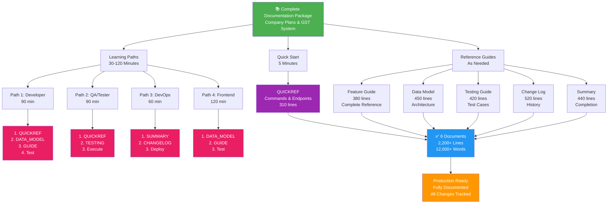

# 📚 Documentation Package Overview Diagram

## Visual Guide to Documentation Structure



---

## 📖 How to Read This Diagram

The diagram shows three main paths through the documentation:

### 🚀 Quick Start (Top - 5 Minutes)
For developers who need answers fast:
- **QUICKREF** document with commands, endpoints, and debugging

### 📚 Learning Paths (Middle - 30-120 Minutes)
Four role-based learning paths:
- **Path 1**: Developer (90 min) - Full onboarding
- **Path 2**: QA/Tester (90 min) - Testing workflow
- **Path 3**: DevOps (60 min) - Deployment & operations
- **Path 4**: Frontend (120 min) - API integration

### 📖 Reference Guides (Bottom - As Needed)
All 6 comprehensive documents available for lookup:
- **Feature Guide** (380 lines) - Complete feature documentation
- **Data Model** (450 lines) - Architecture and relationships
- **Testing Guide** (420 lines) - Test procedures and cases
- **Change Log** (520 lines) - All modifications tracked
- **Summary** (440 lines) - Project completion status

---

## 📁 Document Locations

```
mylab-platform/
├── DOCUMENTATION_INDEX.md              ← Start here for navigation
├── DOCUMENTATION_OVERVIEW_DIAGRAM.md   ← This file (visual overview)
├── IMPLEMENTATION_SUMMARY.md           ← Project completion
├── SESSION_COMPLETE.md                 ← Session summary
└── backend/
    ├── QUICKREF_COMPANY_PLANS.md       ← Fast lookup
    ├── DATA_MODEL_REFERENCE.md         ← Architecture
    ├── COMPANY_PLANS_GST_GUIDE.md      ← Full feature guide
    ├── TESTING_COMPANY_PLANS_GST.md    ← Testing procedures
    ├── CHANGELOG_COMPANY_PLANS.md      ← All changes
    └── .env.example                    ← Configuration template
```

---

## 🎯 Choose Your Path

| Role | Start With | Time |
|------|-----------|------|
| **Developer** | QUICKREF → DATA_MODEL → GUIDE | 90 min |
| **QA/Tester** | QUICKREF → TESTING | 90 min |
| **DevOps** | SUMMARY → CHANGELOG → GUIDE | 60 min |
| **Frontend** | DATA_MODEL → GUIDE → Test endpoints | 120 min |
| **Manager** | IMPLEMENTATION_SUMMARY → SESSION_COMPLETE | 20 min |

---

## ✨ Color Key

- 🟢 **Green** - Main documentation package entry point
- 🟣 **Purple** - Quick reference for speed
- 🔴 **Red** - Role-specific learning paths
- 🔵 **Blue** - All documents work together
- 🟠 **Orange** - Final production-ready status

---

Created: February 4, 2026  
Status: ✅ Complete  
Total Documentation: 2,200+ lines, 12,000+ words
